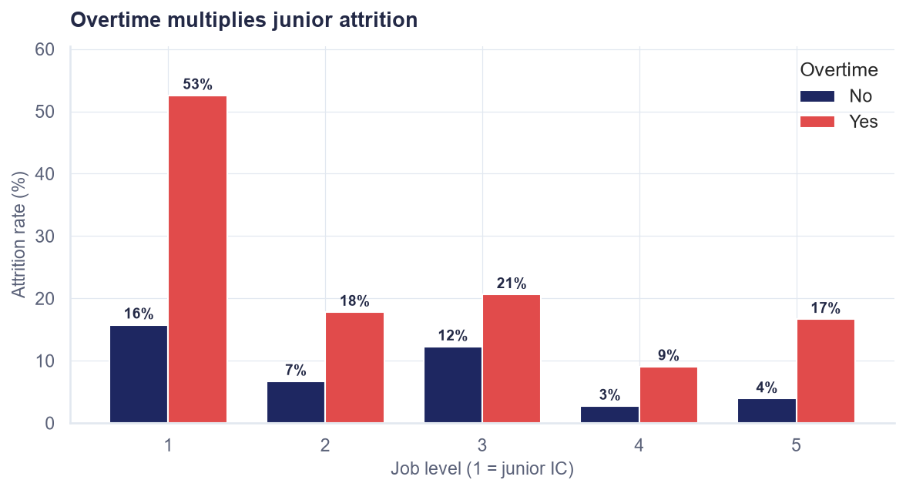

# Employee Attrition: Cost Model, Prediction, and Retention Strategy

**What does 16% annual attrition actually cost a 1,470-person tech company,
and which retention investments pay for themselves?** Most attrition
analyses stop at "we built a model that predicts who leaves." This project
treats prediction as the middle step, not the deliverable: it builds a
defensible cost-of-attrition model to put a dollar figure on the problem
($8.67M/yr), uses descriptive analysis and interpretable ML to find where
the money is bleeding, and then prices three intervention options —
including one that looks obvious but *fails* the ROI test — into a strategy
deck a CHRO could act on.

**Dataset:** the public, synthetic [IBM HR Analytics Employee Attrition &
Performance](https://www.kaggle.com/datasets/pavansubhash/ibm-hr-analytics-attrition-dataset)
dataset (1,470 employees; credited and documented in
[data/README.md](data/README.md)). The dataset is standard; the original
work here is the **cost model and its benchmarked assumptions**, the
**intervention ROI comparison**, and the honest treatment of what this data
can and cannot support.

## Key findings

- **Attrition costs $8.67M/yr — 7.6% of payroll.** Average departure:
  $36.6K ≈ 7.1 months of salary, from a four-component model (recruiting,
  onboarding, vacancy, ramp-up) that lands inside SHRM's 6–9-month
  benchmark and at the conservative end of Gallup's 0.5–2×-salary range.
- **A third of all attrition comes from 11% of headcount**: junior (Level 1)
  employees working overtime leave at **52.6%** vs. the 16.1% company
  average. First-year employees leave at 34.9%; bottom-quartile earners at
  29.3%.
- **Models: logistic regression 0.81 ROC-AUC, XGBoost 0.79** (the simpler
  model wins on this small tabular dataset, and is reported as such).
  Drivers agree across both models and across SHAP/odds-ratio views:
  overtime (~2× odds), low income/level/tenure, frequent travel — plus
  **promotion stagnation (OR ≈ 1.6/SD), which only appears once tenure is
  controlled for** and is invisible in raw segment cuts. At the operating
  threshold, the model catches 71% of leavers while flagging 33% of staff.
- **Broad pay raises fail the ROI test**: raising the bottom quartile 10%
  costs $1.04M/yr recurring but saves only ~$0.40M in replacement costs.
  The recommended package (targeted overtime reduction + first-year
  experience program) projects **≈$1.25M/yr savings for ~$420K/yr cost
  (~3× ROI)** — with effect sizes stated as assumptions and a pilot design
  to validate them.



## Repository structure

```
├── data/                  # dataset + source/license documentation
├── notebooks/
│   └── attrition_analysis.ipynb   # executed walkthrough of the analysis
├── src/attrition/         # reusable modules
│   ├── data.py            #   loading, cleaning, quality checks
│   ├── cost_model.py      #   cost-of-attrition calculator + assumptions
│   ├── modeling.py        #   feature prep, training, evaluation
│   └── viz.py             #   shared chart style
├── scripts/               # pipeline entry points (run in order)
├── reports/
│   ├── strategy_deck.md / .pptx   # 8-slide strategy deck
│   ├── summary.md         #   one-page written summary
│   └── figures/           #   presentation-quality charts
├── outputs/               # generated tables + data-quality/model reports
└── tests/                 # data integrity + cost model tests
```

## Methodology (concise)

1. **Clean & explore** — drop zero-variance columns, document quality
   issues ([outputs/data_quality_report.md](outputs/data_quality_report.md)),
   compute attrition rates by department, role, level, tenure, overtime,
   satisfaction, and pay; identify rule-based flight-risk segments.
2. **Cost model** — four components per departure, tiered by job level:
   recruiting (20% of salary), onboarding (10%), vacancy (1.5–4 months ×
   salary), ramp-up (3–6 months at 50% productivity). Every multiplier is
   stated in [src/attrition/cost_model.py](src/attrition/cost_model.py) and
   sanity-checked against SHRM/Gallup published ranges (enforced by tests).
3. **Predict** — logistic regression baseline + XGBoost, stratified 75/25
   split, 5-fold CV, class-imbalance handling; evaluated on ROC-AUC/PR-AUC
   with a recall-oriented operating threshold (accuracy is meaningless at a
   16% base rate). Interpretation via odds ratios and SHAP.
4. **Recommend** — three interventions costed against the segments they
   target; recommendation includes overlap discounting, a pilot/control
   design, and explicitly stated assumptions.

## Reproducing the analysis

Requires Python 3.11+.

```bash
git clone https://github.com/shalom-wu/attrition-analysis.git
cd attrition-analysis
python -m venv .venv && source .venv/bin/activate   # .venv\Scripts\activate on Windows
pip install -r requirements.txt
pip install -e .

# Full pipeline (~2 min, deterministic — all seeds fixed)
python scripts/run_eda.py
python scripts/run_cost_model.py
python scripts/run_modeling.py
python scripts/make_notebook.py     # re-executes the notebook

pytest                              # data integrity + cost model tests
```

The dataset ships with the repo (it is small and publicly redistributable);
[data/README.md](data/README.md) documents the source and an alternative
download path.

## SQL and Power BI layer

The project includes a local DuckDB layer in [sql/](sql). SQL is used for
reproducible row-count checks, attrition KPI cuts, segment validation, and the
Power BI export tables. Start with [sql/README.md](sql/README.md), then run:

```bash
python scripts/run_sql.py
```

The script exports Power BI-ready CSVs to `data/powerbi/`: employee fact data,
department/job-role/overtime/tenure KPI cuts, cost by department, and the
flight-risk segment table. The [power-bi/](power-bi) folder contains a dashboard
brief, data model, DAX measures, manual build instructions, refresh steps, and
static mockups. No `.pbix` is included yet; the folder documents the exact
manual Power BI Desktop build rather than pretending a dashboard file exists.

The workflow is: raw synthetic HR sample -> Python cleaning/cost/modeling ->
DuckDB validation and KPI exports -> Power BI stakeholder dashboard.

## Portfolio Use

**CV bullets**

- Built an end-to-end employee attrition analysis using Python, scikit-learn,
  SHAP, and a cost model to identify retention-risk segments and replacement
  cost exposure across 1,470 synthetic employee records.
- Translated model output into a retention strategy: overtime-heavy junior
  employees and early-tenure hires surfaced as the clearest intervention
  candidates.
- SQL-focused: Added DuckDB validation and KPI views that reproduce attrition,
  cost, overtime, tenure, and segment cuts from the included project data.
- Power BI-focused: Prepared dashboard-ready tables and build documentation for
  an executive KPI, attrition diagnostic, and retention decision-support report.

**LinkedIn description**

> Employee Attrition Analysis & Retention Strategy - I built this project to
> answer a practical HR question: where is attrition risk concentrated, and
> what would it cost the business if those departures are not addressed? The
> dataset is IBM's fictional HR sample via Kaggle, so I treated the results as
> a decision-support framework rather than company truth.

**Interview explanation**

> "I used Python for the modeling and cost logic, SQL as the reproducible
> validation layer, and Power BI as the stakeholder-facing version. The data is
> synthetic and cross-sectional, so I would use this as a retention
> prioritization framework, not proof that one factor causes attrition."

**Likely interview questions**

1. *Why use a synthetic HR dataset?* Because it is public and safe to share;
   the portfolio signal is the workflow, cost framing, and interpretation.
2. *How would this change with company data?* I would use time-based exits,
   distinguish voluntary and involuntary turnover, and validate on a later
   period.
3. *How do the tools work together?* Python does modeling and cost work, SQL
   checks definitions and exports KPI tables, and Power BI turns those same
   definitions into a stakeholder dashboard.

## Caveats & limitations

- **The data is synthetic and cross-sectional.** IBM generated it; there
  are no hire/exit dates, so no survival analysis or time-based validation
  is possible. A production version of this work would train on
  longitudinal HRIS data and validate on a later time window.
- **Correlation, not causation.** Overtime predicts attrition; the data
  cannot prove that cutting overtime cuts attrition. Intervention effect
  sizes (−25%/−20% relative) are industry-plausible assumptions the
  proposed pilot is designed to test — they are not model outputs.
- **237 positive cases** → wide confidence intervals on per-role estimates
  (CV std ≈ 0.03–0.05 AUC).
- **No voluntary/involuntary split** — some departures may be terminations,
  which would inflate the "regrettable attrition" cost.
- **No market compensation benchmark** — low earners leave more, but the
  data can't distinguish "paid low" from "paid below market," which matters
  for comp-based interventions.
- **Ethics**: risk scores are for prioritizing support (check-ins, workload
  relief), never punitive action, and should not surface in performance
  contexts.

## Author & license

Shalom Wu ([@shalom-wu](https://github.com/shalom-wu)) · MIT License ·
Dataset © IBM, redistributed per its public availability (see
[data/README.md](data/README.md)).
